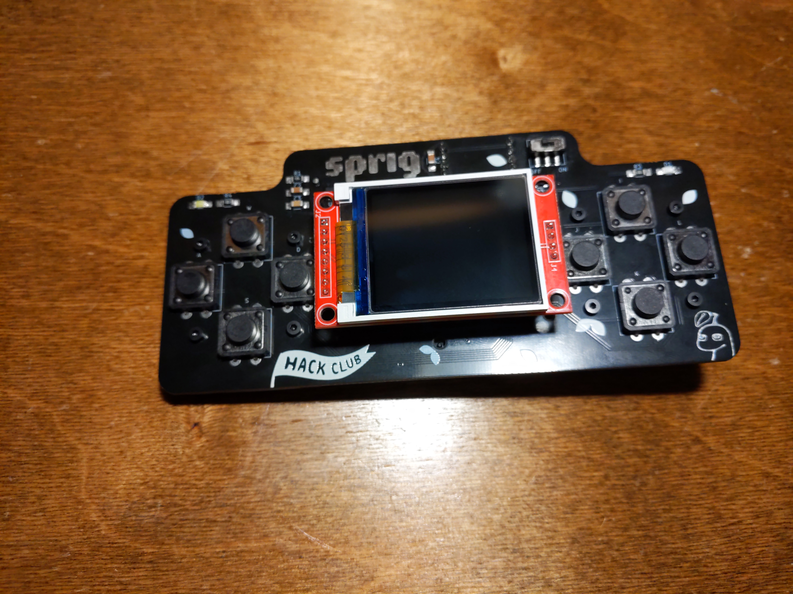

# Sprig Assembly Guide

Heyo! Congrats on your new Sprig!

Before you assemble your Sprig, which hardware revision do you have?

Pssst! A little hint, if you received your Sprig in 2025 or later, it's revision 1.1!

You can also tell by the color of the PCB that the screen is attached to. If it's blue or black, it's a revision 1.0. If it's red, it's revision 1.1!

| [Revision 1.0 (Black/blue screen) (2023-2025)](assembly/v1.0.md) | [Revision 1.1 (Red screen) (2025-present)](assembly/v1.1.md) |
|-----------------------------------------------------|----------------------------------------------|
|  |   |
