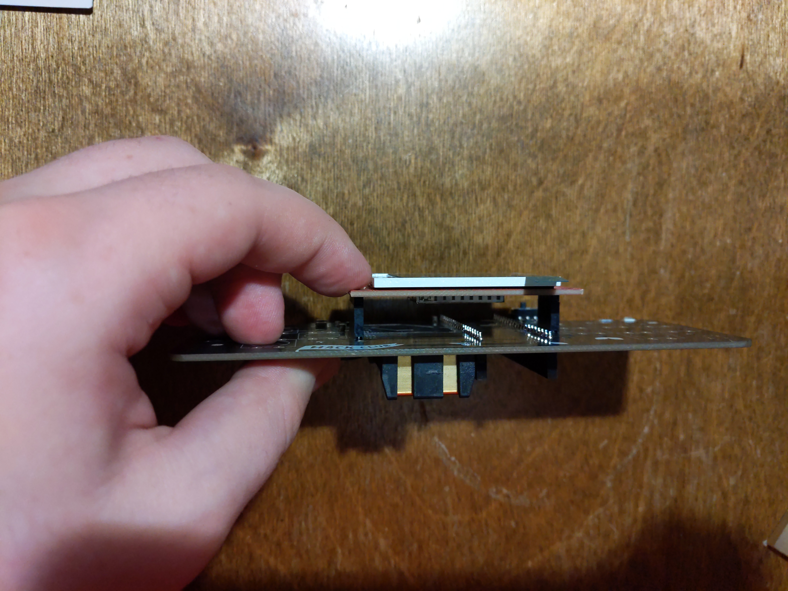
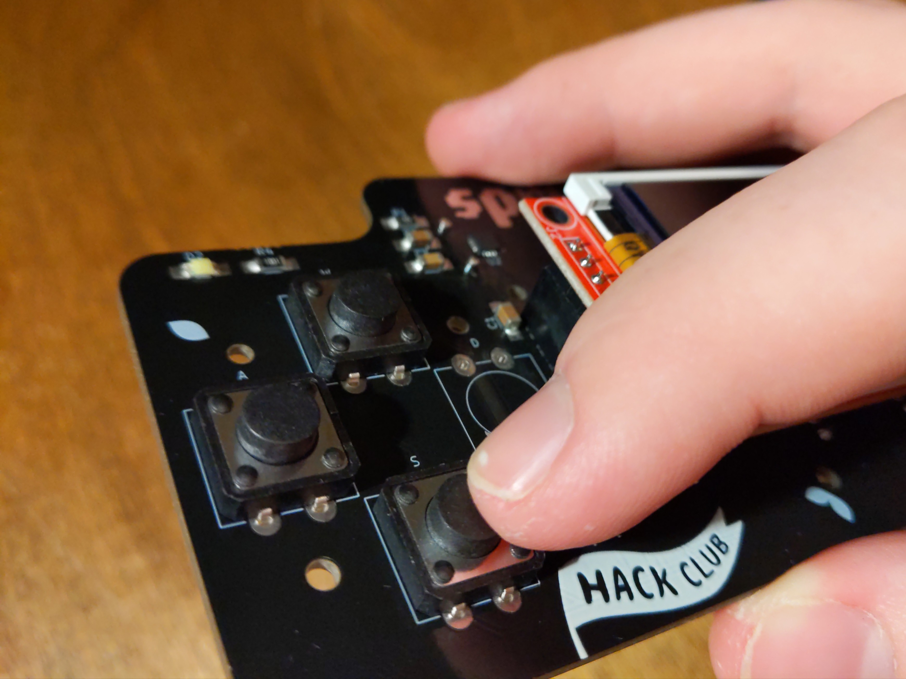
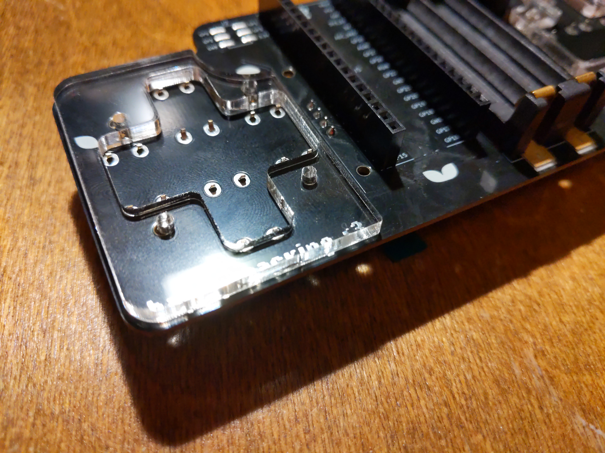
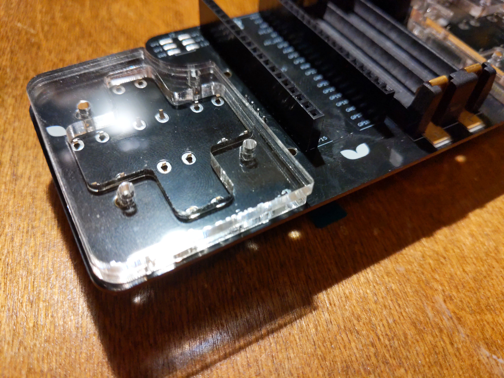
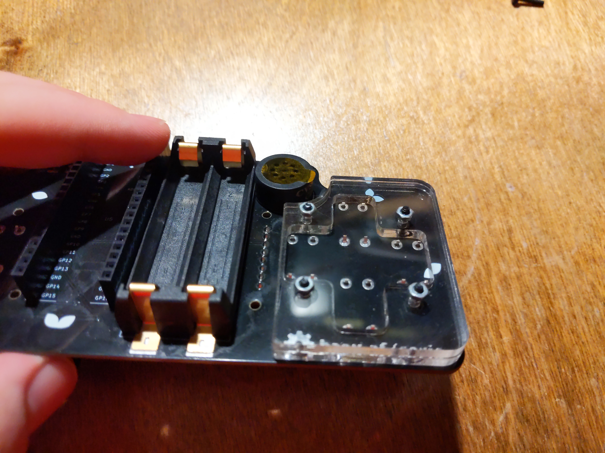
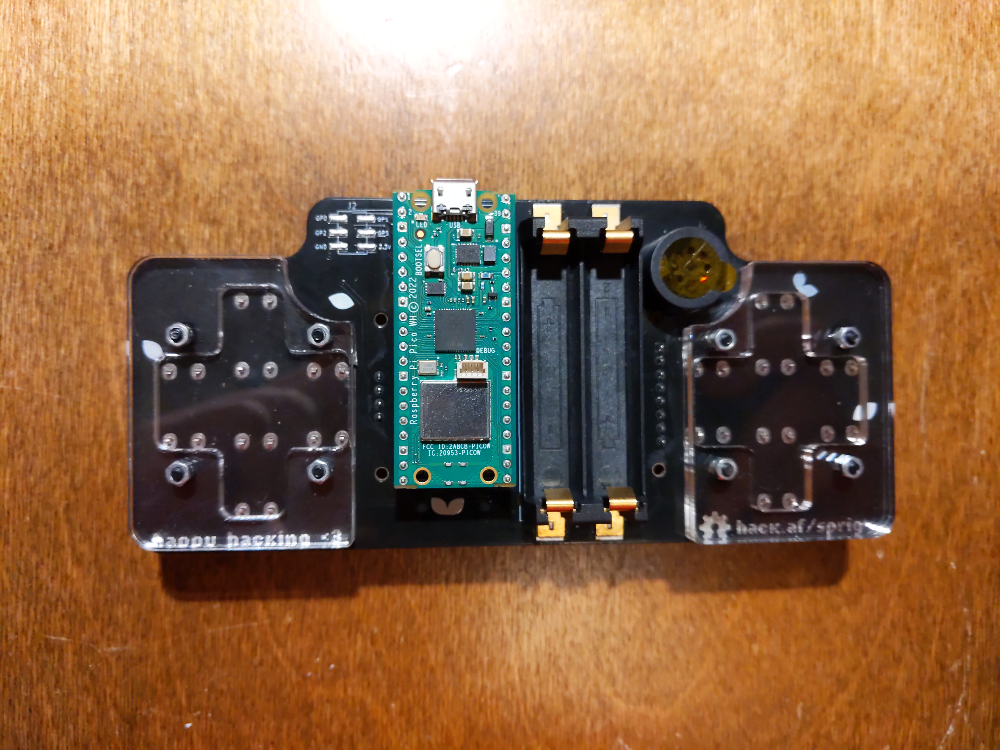
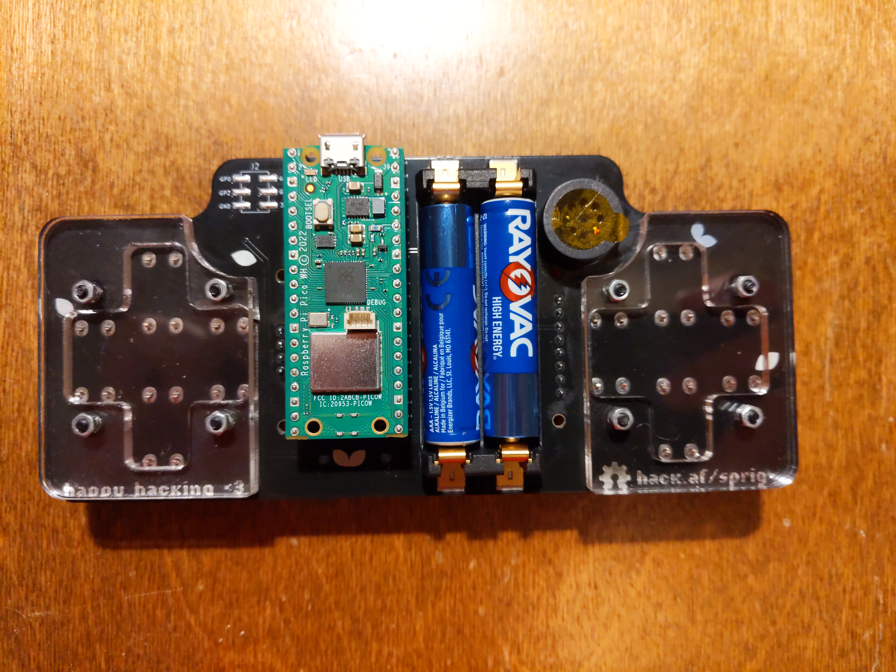

# Assembling your Sprig (HW rev. 1.1)

Your Sprig console is a piece of open source hardware and can also be used as a hardware development kit (all the unused GPIO pins are broken out!). We made it into a game console and invite you to enjoy it as such. But we encourage you to make it something else! Feel free to use your Sprig or any of its components to make anything you can dream of!

Below are instructions for assembling your Sprig console.

## What's in the box

| Quantity | Item                                                                      |
| -------- | ------------------------------------------------------------------------- |
| 1        | Sprig PCB                                                                 |
| 1        | LCD screen                                                                |
| 1        | Raspberry Pi Pico                                                         |
| 4        | clear backings (2 with D-pad cutouts, 2 solid)                            |
| 8        | Tactile button switches*                                                  |
| 1        | bag of hardware for backings (8 M2\*10mm screws, 8 hex nuts, allen key)\* |
| 1        | adapter or micro-USB cable                                                |
| 2        | AAA batteries                                                             |
| ???      | Oodles of our world-famous Hack Club stickers!!                           |

\* May include extra hardware.

## Instructions

1. Connect the LCD screen to the pins on the top of the board.

3. Put 4 buttons in corresponding holes on each side of the board. You'll have 2 extra buttons.

4. Turn the board over, and put the clear plastic backings on. The first piece should have a D-pad cutout; the solid piece should be on top. The screw holes and D-pad cutout may need to be cleared out - you can use the included allen wrench to break off any excess plastic from the holes. Make sure to peel off the protective film on the front and back of each piece!

5. Put the shorter screws in holes and add nuts on the top side of the board. Tighten using the allen key provided. Repeat for the clear backings on the other side.

6. Put in the Raspberry Pi Pico, with the USB port facing the top of the Sprig. It is difficult to remove the Pi Pico once installed, so be sure it is correctly oriented!

7. Put in 2 AAA batteries.

**Now you can start uploading games to your Sprig! See the [upload guide](../UPLOAD.md) for instructions on how to set up your Raspberry Pi Pico.** ➡️
